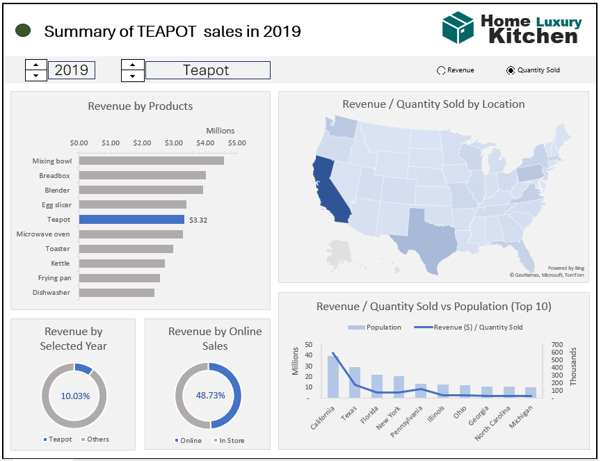

# 📊📈📉 Home Luxury Kitchen - Sales Dashboard

## Table of Contents
  - [Introduction](#introduction)
  - [Problem Objective](#problem-objective)
  - [Dataset Used](#datasets-used)
  - [Tools & Techniques](#tools-&-techniques)
  - [Road Map](#road-map)
  - [Dashboard Components](#dashboard-components)

## Introduction

As a new data analyst at **Home Luxury Kitchen**, a company that sells kitchen equipment, you have been given a dataset containing data from 2019 to 2022. The sales manager wants you to create a dashboard that summaries the sales performance during the period. You are requested not to use Pivot Tools like Power Pivot to create the dashboard.

## Project Objective
The objective of the project is to create a fully functional interactive sales dashboard in Advance Excel using only functions and formulas without the use of power tools like Power Query and Power Pivot.

- **Primary Goal:** Develop a dashboard that summarizes from a dataet without the use of power tools.
- **Business Focus:** Provide insights and actionable recommendations to drive business strategy.

## Tools & Techniques
- **Advance Excel Functions and Formulas:** Utilize various built-in Excel functions (e.g., `SUMIF`, `VLOOKUP`, `INDEX/MATCH`, etc.) to analyze the dataset.
- **Data Structuring:**
  - Use a whole range or convert your data into a table for dynamic analysis.
  - Ensure your formulas update automatically as new data is added.
- **Dashboard Elements:** Create a visually appealing and easy-to-read dashboard using charts, conditional formatting, and clear labeling.
- **No Pivot Tables:** Focus on using formulas and manual chart setups instead of Pivot Tables.

## Road Map
1. **Use Excel Functions and Formulas:**

   - Leverage a variety of Excel functions to calculate totals, averages, and other key metrics.
   - Example functions include `SUMIF`, `COUNTIF`, `AVERAGE`, and logical functions like `IF` and `AND`.

2. **Select a Whole Range or Turn Your Data into a Table:**

   - Convert raw data into a structured table to enable dynamic range references and facilitate easier data management.

3. **Make it Simple:**
   - Ensure the dashboard is clear and easy to understand. Avoid clutter and use visual elements that make the data immediately comprehensible.
   - Focus on key performance indicators (KPIs) that truly matter to the business.
   - Consider aspects such as product performance, market trends, and potential areas for cost savings or revenue growth.

## Dashboard Components

- **Header Section:** Company logo, dashboard title, and reporting period.
- **Key Metrics Summary:** Display total sales, average order value, number of orders, etc.
- **Visual Charts:** Use line charts, bar charts, and other visuals to depict trends and comparisons.
- **Detailed Breakdown:** Provide additional insights like top-selling products, regional performance, and sales by sales channel.
- **Recommendations:** Clearly highlight strategic recommendations based on the data analysis.

Click [here](https://github.com/Akama-EO/bi-portfolio-projects-/blob/main/Sales/Dataset.xlsx) to view/download the complete solution for the project.
